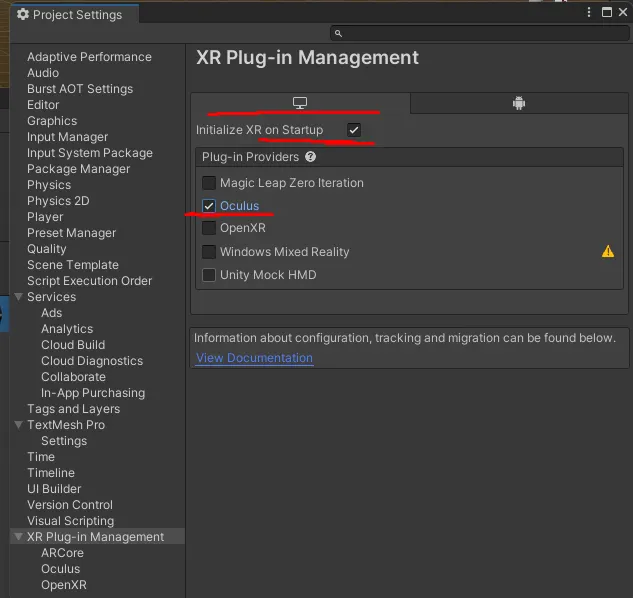
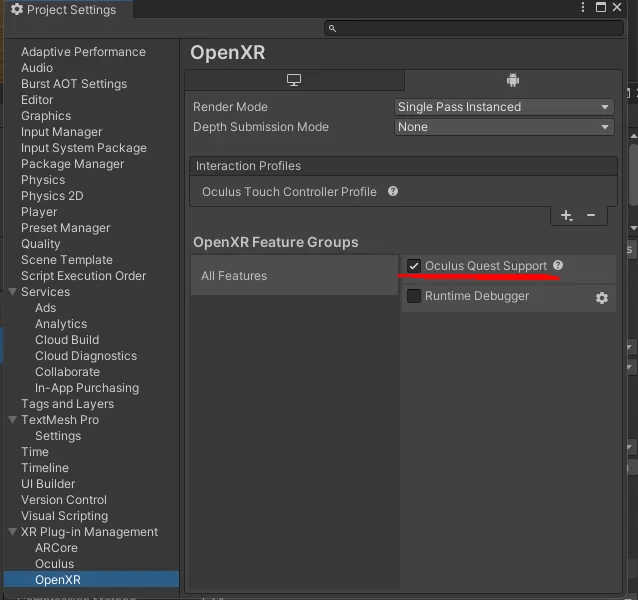
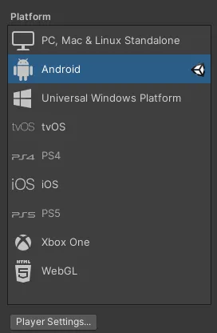

+++
title = "Why does the Quest 2 Unity Application open in window mode instead of VR mode?"
description = "Troubleshooting steps to ensure your Unity application launches in VR mode on Meta Quest 2."
date = 2022-11-18
tags = ["Unity", "Meta Quest 2", "VR Development", "OpenXR", "XR Plugin Management"]
+++

There are several reasons why the Unity application may open in window mode on Meta Quest 2. This issue can be particularly frustrating when updating apps on platforms like Oculus App Lab. If your application is functioning in window mode, consider the following troubleshooting steps:

## 1. XR Plug-in Settings

Navigate to **Edit > Project Settings > XR Plug-in Management** in the Unity Editor.

Ensure the following settings are configured:
- Enable **"Initialize XR on Startup"** for both Android and PC tabs.
- Check the **Oculus** option under both Android and PC tabs.

## 2. OpenXR Settings

Within the **XR Plug-in Management** settings, access the **OpenXR** settings tab.

Verify that **Oculus Quest Support** is enabled in the OpenXR Feature Groups.

## 3. Target Platform Configuration

Ensure that the Unity target platform is set to Android for Oculus Quest 2 development.

Navigate to **File > Build Settings > Player Settings** and confirm that Android is selected as the target platform.

## 4. Console Errors

Check the Unity Editor console for any errors related to XR plugins. Addressing these errors can resolve issues with VR mode initialization.

## 5. Testing with Oculus Link

Consider running your application in Play mode using Oculus Link to test its functionality in VR mode.

By following these steps, you can ensure that your Unity application launches directly into VR mode on Meta Quest 2, providing a seamless experience for users.
