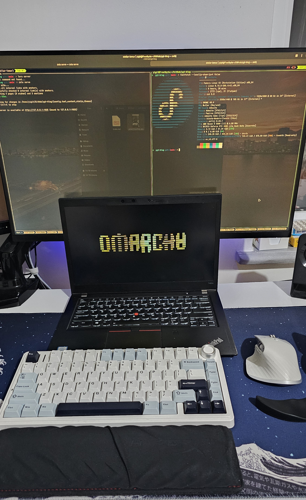

+++
title = "Omarch: My Fastest and Most Beautiful Dev Setup Yet"
description = "Trying Omarch by DHH — a single-ISO Arch Linux distro with Hyprland, LazyVim, full dev environments, and stunning themes — and why it impressed me more than Fedora or Windows."
date = 2025-09-15
tags = ["Omarchy","Fedora","Windows","NVIDIA","Visual-Studio","Zola","Tabi","daily-update"]
+++

I recently tried **Omarch**, the Arch-based distro made by **DHH** (creator of Ruby on Rails), and I’m honestly blown away. This isn’t just Arch preinstalled with a few packages — it’s a **complete, curated system**.

Omarchy comes with **Hyprland**, **LazyVim**, and an entire development setup ready to go — but what impressed me most is how **effortless** everything feels. The configuration and setup experience is smooth, consistent, and genuinely enjoyable.

And the best part? It’s a **single ISO install** that sets up a complete development environment, and a keyboard-driven workflow in minutes. You don’t spend hours configuring like you would with vanilla Arch — you reboot, log in, and you’re ready to work.

For now, I installed Omarch on my thinkpad, and I’m not ready to switch my Fedora desktop just yet. Fedora is still my main machine, and I keep **Windows** around for two things I can’t replace:
- **NVIDIA GPU performance** — my RTX 3080 runs at full speed and drivers are far more stable and performant in Windows than on Linux.
- **Microsoft Visual Studio** — for some C++ projects, Visual Studio and its build tools are still the most reliable and convenient choice.

*My Current Setup. Omarchy even comes with cool screen savers. (Just Ignore the cables i hade to replace one of them recently 😱)*

Even so, Omarch might be the most exciting development setup I’ve tried. It feels like a hacker’s dream machine, right out of the box, and I love how easy it is to configure and make my own.

By the way, this site you’re reading is built with **Zola**, the Rust-based static site generator, using the **Tabi** theme — fast, clean, and perfect for sharing posts like this.
