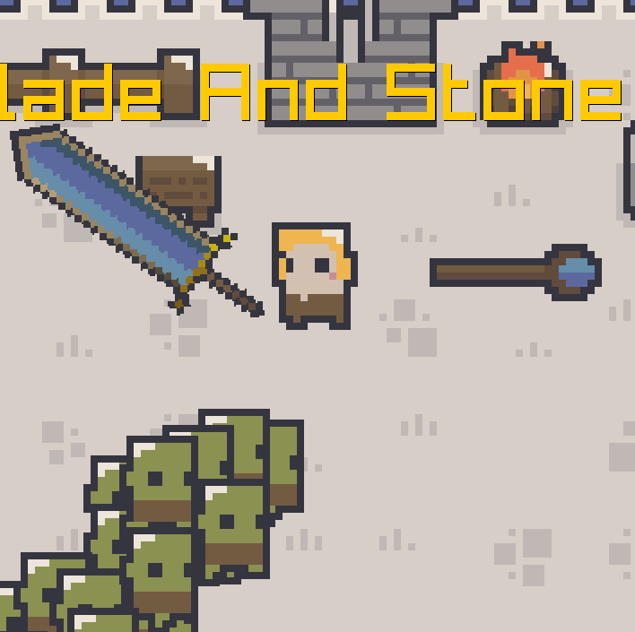

+++
title = "Blade & Stone 2"
description = "Top-down roguelike game built in C++, Raylib, Box2D, and LDtk"
weight = 1
template = "page.html"

[taxonomies]
tags = ["gamedev", "cpp", "roguelike", "raylib"]

[extra]
local_image = "img/bs2.png"

+++

# Blade & Stone 2


A **top-down roguelike** built in C++ showcasing modern game development with Raylib, Box2D, and LDtk integration.

{{ admonition(type="tip", text="Play the web version on [itch.io](https://tlamir.itch.io/blade-and-stone-2) or download the Windows build from GitHub releases.") }}

## What It Is

Blade & Stone 2 demonstrates **modern C++ game development** by combining automatic combat, physics-based movement, and dynamic level design. It's a complete roguelike experience that shows how C++ can handle rendering, physics, and complex game systems efficiently.

**Key Features:**
- Automatic combat with dual weapon system (sword + magic bullets)
- Physics-driven movement using Box2D
- Level design powered by LDtk with automatic collision detection
- Dynamic enemy spawning system
- Debug visualization for developers

## Technical Stack

```cpp
// Modern C++20 features throughout
class Player {
    std::unique_ptr<Weapon> primaryWeapon;
    std::vector<std::shared_ptr<Ability>> abilities;

    void update(float deltaTime) {
        // Physics integration with Box2D
        handleMovement(deltaTime);
        processAbilities();
    }
};
```

**Built With:**
- **C++20** - Modern features, smart pointers, ranges
- **Raylib 5.0** - Clean 2D graphics API
- **Box2D 2.4.1** - Physics engine
- **LDtk** - Level editor integration
- **{fmt}** - String formatting

## Why This Project Matters

This isn't just another game - it's a **technical showcase** demonstrating:

- How to integrate multiple C++ libraries effectively
- Modern C++ practices in game development
- Clean architecture for extensible game systems
- Cross-platform development (Windows/Web)

## Play & Explore

**🎮 [Play on itch.io](https://tlamir.itch.io/blade-and-stone-2)**
**📺 [Watch Gameplay](https://www.youtube.com/watch?v=GlSLxQbG-0g)**
**⬇️ [Download Windows Build](https://github.com/Tlamir/BladeAndStone2/releases/tag/Windows)**

#### [View Source Code](https://github.com/Tlamir/BladeAndStone2){.centered-text}

**Controls:** WASD to move, Space to start/reset
